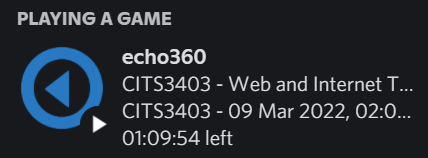

# Echo360 RPC

## Features

- Discord RPC when watching a video on echo
- Injection of extra playback speeds into video playback settings

### Example Presence

## Setup

Go to the [latest releases](../../releases/latest) page and download the zip file in the assets section - this zip is a smaller version of the source code, and only includes the resources actually needed by the chrome extension. To actually install the extension, in chrome navigate to <chrome://extensions>, activate "Developer Mode", and drag and drop the zip file onto the page. Follow any prompts.

This extension uses the [Discord Rich Presence](https://chrome.google.com/webstore/detail/discord-rich-presence/agnaejlkbiiggajjmnpmeheigkflbnoo) extension for Discord RPC support. It won't work unless you install that extension (and application!) too.
